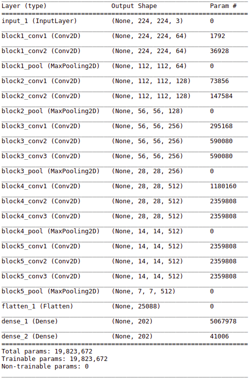
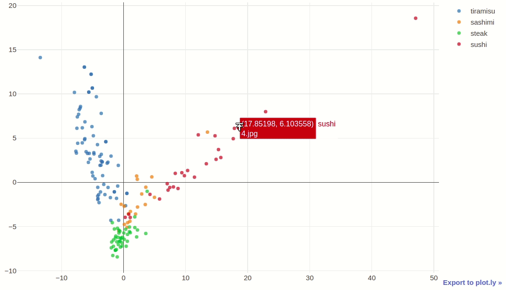
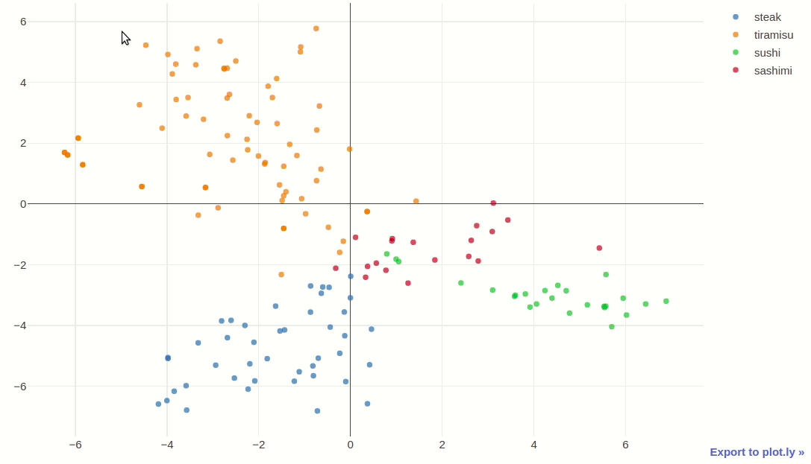
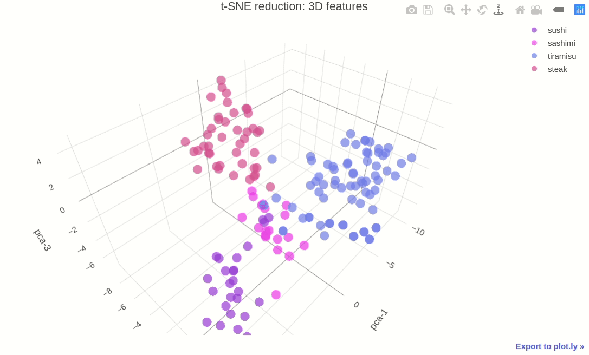

# Multimodal classification of cooking recipes

## [Image feature extraction:](http://nbviewer.jupyter.org/github/xkaple01/multimodal-classification/blob/image_feature_extraction/image_feature_extraction/feature_extraction.ipynb)

### Neural network architecture:

### [Extracted features visualization:](http://nbviewer.jupyter.org/github/xkaple01/multimodal-classification/blob/image_feature_extraction/image_feature_extraction/extracted_features_visualisation.ipynb)

### - [PCA 2D](https://plot.ly/~xkaple01/179)

### - [t-SNE 2D](https://plot.ly/~xkaple01/181)

### - [t-SNE 3D](https://plot.ly/~xkaple01/177)

