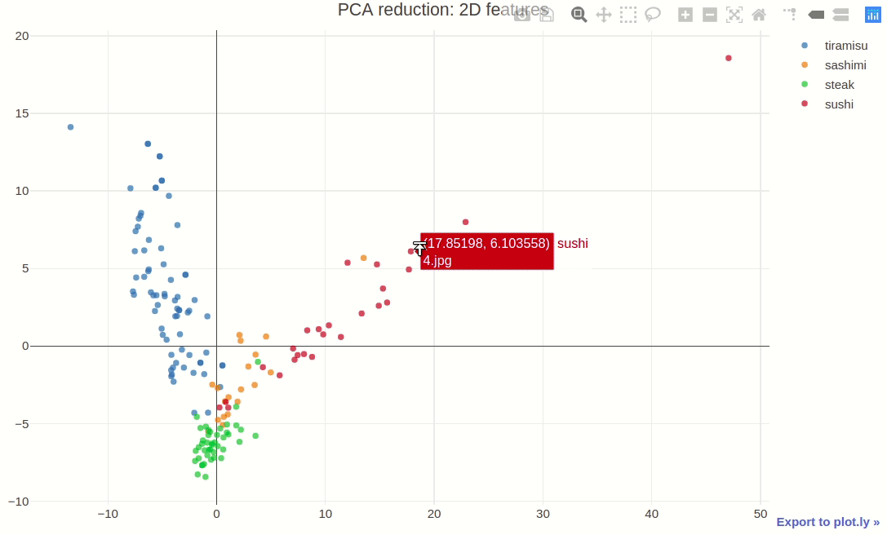
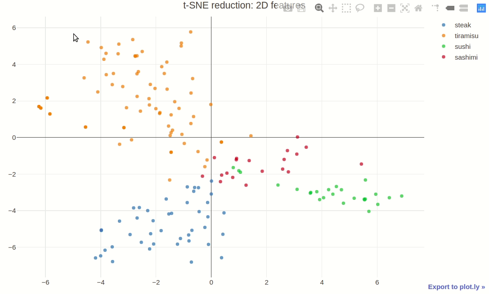

# Multimodal classification of cooking recipes

## Image feature extraction:

### Neural network architecture:

### Extracted features visualization:

### - PCA 2D

### - t-SNE 2D

### - t-SNE 3D

