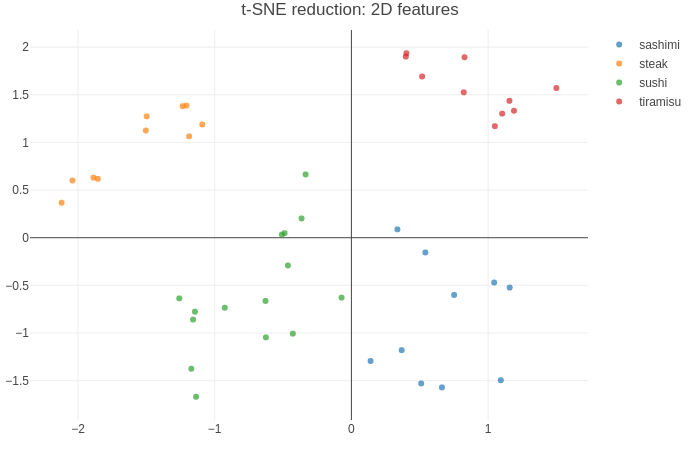

# Multimodal classification of cooking recipes

## Text features extraction

### Doc2vec extracted features:

### Nearest vectors to specified words:

### Text preprocessing pipeline for doc2vec using:
1) remove numbers from text
2) lowercase
3) retain only nouns
4) lemmatization
5) stop words removing (minute,gram,pound,...)
6) delete rare nouns
