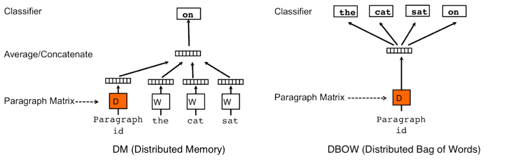
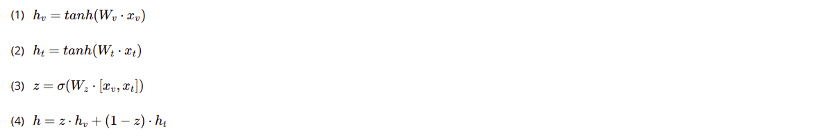

# Multimodal classification

## Introduction

The classification task of the real-world multimedia data can be sufficiently complex for a single machine learning model. One of the possible ways to achive more precise results lies in the using of the multiple models to process multiple modalities (e.g. visual modality and textual modality) of the same datasource.  
The goal of the project is to show the performance of the multimodal classification approach on the common real-world dataset.  
The introduced multimodal classification method is based on using of the 3 neural networks:
- The first neural network extracts features from the visual modality
- The second neural network extracts features from the textual modality
- The third neural network decides which of 2 modalities is more informative one and then performs the classification with paying more attention to the more informative modality and less attention to the less informative modality  

## Dataset

Dataset consits of 45 cooking recipes collected from the internet portals. The photos of the cooked meal define the visual modality (input to the first neural network) and the text of recipe (ingridients and cooking method) is the textual modality (input to the second neural network).  
Collected dataset is not large, but is complex enough: dataset consists of 4 food categories (steak, tiramisu, sashimi and sushi). Two of categories were choosen such that the repices are sufficiently similar (sashimi and sushi have a lot of common ingridients; cooked meals looks similarly). The dataset is imbalanced: 1 category contains 15 recipes and each of 3 remaining categories contain 10 recipes. Moreover, some recipes are long and detailed, contain multiple photos of the meal, while another recipes are very short.   

## [Image feature extraction:](http://nbviewer.jupyter.org/github/xkaple01/multimodal-classification/blob/image_feature_extraction/image_feature_extraction/feature_extraction.ipynb)

### Neural network architecture:
CNN consiting of the 13 convilutional layers, 5 max pulling layers and 2 dense layers extracts feature vector of length 202 from each image. In case that the recipe has multiple images, neural network extracts feature vector from each image, then the mean value of all obtained vectors is computed.  

### [Extracted features visualization:](http://nbviewer.jupyter.org/github/xkaple01/multimodal-classification/blob/image_feature_extraction/image_feature_extraction/extracted_features_visualisation.ipynb)

### - [PCA 2D](https://plot.ly/~xkaple01/179)

### - [t-SNE 2D](https://plot.ly/~xkaple01/181)

### - [t-SNE 3D](https://plot.ly/~xkaple01/177)

## Text features extraction
Feature extraction from the recipe text is performed in unsupervised manner via doc2vec neural network architecture adopted for our task. Obtained feature vectors of the recipes belonging to the same category are more similar than the feature vectors of recipes belonging to the different categories. The length of the feature vector is 12 (this value is sufficient due to the small size of the dataset)  

### Doc2vec architectures  
  
Both of doc2vec architectures were tried, then the resulting neural network was obtained by such modification of classical architectures that brings the best performance on our dataset.  

### [Text preprocessing pipeline for doc2vec using:](http://nbviewer.jupyter.org/github/xkaple01/multimodal-classification/blob/text_feature_extraction/text_feature_extraction/prepare_texts_for_doc2vec.ipynb)
1) removing the numbers from text:  
the text of 2 recipes can be the same except that the first recipe can be designed for 2 people, while the second - for 4 people; the amount of ingridients have not to be the discriminative feature for the given category of the cooking recipes
2) lowercasing the text
3) retaining only the nouns
4) performing lemmatization
5) removing of the stop words (gram, pound, ...):  
the text of 2 recipes can be the same except that the first recipe describes the needed amount of ingridients in grams, while another - in pounds 
6) deleting the rare nouns:  
rare is the noun which occurs less than 3 times in the all recipes belonging to the same category  

### [Doc2vec extracted features:](http://nbviewer.jupyter.org/github/xkaple01/multimodal-classification/blob/text_feature_extraction/text_feature_extraction/doc_embeddings_visualisation.ipynb)

### Nearest vectors to specified words:

## Multimodal classification - gaited multimodal unit:
Consider the following scenarios:  
- the text of the recipe is very detailed, but the photo of the meal is taken at the wrong angle:  
in this case the recipe can be successfully classified based on the textual modality
- the recipe is too exotic, but the meal on the photo doesn't differs too much from the other meals of this category:
in this case the recipe can be successfully classified based on the visual modality  
The task of the gaited multimodal unit is to estimate how informative is the visual modality and how informative is the textual modality of the given recipe. More informative modality is more important for the final classification performed by the GMU.  

GMU schema:  
  
  

### Results of multimodal classification  
Gaited multimodal unit was tested on 13 randomly choosen recipes (32 were used for training). 
Test dataset:  
- 3 recipes of sashimi (label 0)
- 3 recipes of steak (label 1)
- 4 recipes of sushi (labes 2)
- 3 recipes of tiramisu (label 3)  

   

GMU classified all 13 recipes correctly:
- sashimi category was classified by paying more attention to the visual modality
- steak category was differed from the other categories exclusively based on the textual modality
- sushi category was classified based on the visual modality
- tiramisu category differs from others by the textual modality 
  
The explanation of the results might be the following:  
- sushi and sashimi looks very different from the other meals, so these categories can be easily differed from the other categories based on the photos
- the photos of the steak and the tiramisu might not be sufficiently discriminative (especially the close-up photos: both meals can look as the brown substance), so it is more suitable to classify mentoined categories based on the recipe text
- in case that the classification based almost on the only single modality is hard, GMU can give almost the same importance to the textual and to the visual modality: test sample number 1 (recipe of sashimi) was correctly classified by giving 0.42 of attention to the textual modality and 0.58 to the visual modality   

# Accuracy 100%
